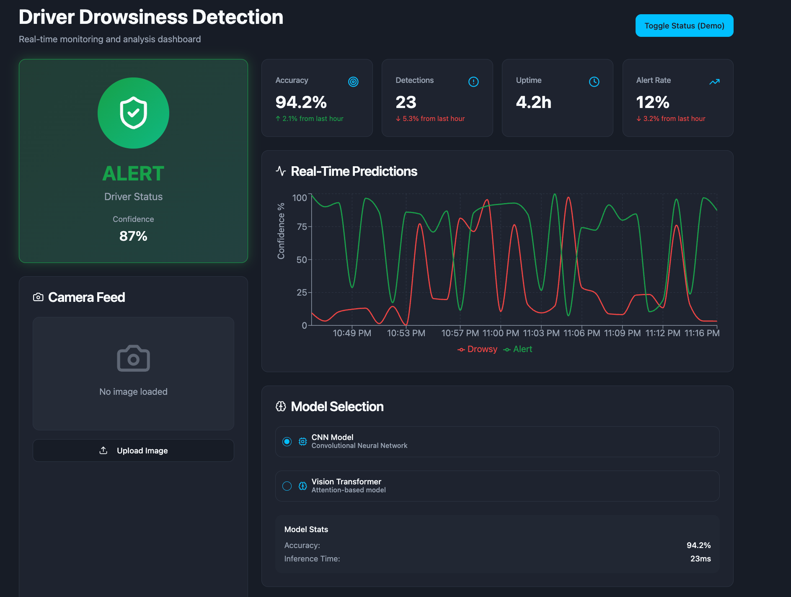

# Real-Time Driver Drowsiness Detection with Multimodal Transformer Models

[](https://www.python.org/)
[](https://www.tensorflow.org/)
[](https://pytorch.org/)

A comprehensive deep learning solution for detecting driver drowsiness in real-time using both Convolutional Neural Networks (CNN) and Vision Transformer (ViT) architectures. This project addresses the critical need for automated drowsiness detection systems to enhance road safety.

**⚠️ Note: This is part of ongoing research work.**

## 📋 Table of Contents

- [Overview](#overview)
- [Key Features](#key-features)
- [Architecture](#architecture)
- [Results](#results)
- [Dataset](#dataset)
- [Installation](#installation)
- [Usage](#usage)
- [Project Structure](#project-structure)
- [Contributors](#contributors)
- [References](#references)
- [Future Work](#future-work)

## 🎯 Overview

Driver drowsiness is one of the leading causes of traffic accidents worldwide. According to the World Health Organization, driver fatigue contributes to 10-20% of all traffic accidents globally. This research implements and evaluates two deep learning models for automated drowsiness detection:

1. **CNN Model (MobileNetV2)**: A lightweight, efficient convolutional neural network using transfer learning
2. **Vision Transformer (ViT)**: A state-of-the-art transformer-based architecture for image classification

Both models are trained on a seven-class driver behavior dataset and include interactive dashboards for real-time monitoring and visualization.

## ✨ Key Features

- **Dual Architecture Implementation**: Both CNN and Vision Transformer models for comparison
- **Seven-Class Classification**: Detects multiple driver states (yawn, open eyes, dangerous driving, drinking, closed eyes, safe driving, etc.)
- **Binary Drowsiness Detection**: Converts multi-class predictions to binary drowsy/alert status
- **Interactive Dashboard**: Real-time Gradio-based interface for model inference and visualization
- **Comprehensive Evaluation**: Accuracy, F1-score, confusion matrices, and detailed performance metrics
- **Anti-Overfitting Measures**: Regularization techniques including dropout, label smoothing, gradient clipping, and early stopping
- **Data Augmentation**: Extensive image augmentation to improve model generalization

## 🏗️ Architecture

### CNN Model (MobileNetV2)

- **Base Model**: MobileNetV2 (pretrained on ImageNet)
- **Input Size**: 224×224×3
- **Architecture**: 
  - MobileNetV2 feature extractor (frozen)
  - Global Average Pooling
  - Dropout (0.5)
  - Dense layer (96 units, ReLU, L2 regularization)
  - Dropout (0.5)
  - Output layer (7 classes, softmax)

### Vision Transformer (ViT)

- **Base Model**: Google ViT-Base-Patch16-224
- **Input Size**: 224×224×3
- **Architecture**:
  - ViT Encoder (first 6 layers frozen)
  - Cross-modal fusion layer with LayerNorm and GELU
  - Multi-layer classifier with dropout regularization
  - Output layer (7 classes)

**Anti-Overfitting Techniques**:
- Layer freezing (first 6 ViT layers)
- Increased dropout rates (0.3-0.5)
- Label smoothing (0.1)
- Gradient clipping (max_norm=1.0)
- Early stopping with patience
- Learning rate scheduling
- Weight decay regularization

## 📊 Results

### Model Performance

| Model | Accuracy | Notes |
|-------|----------|-------|
| **CNN (MobileNetV2)** | 82% | Good generalization, faster inference |
| **Vision Transformer** | 97% | Superior accuracy, higher computational cost |

### Key Findings

- The Vision Transformer model achieved **97% accuracy**, significantly outperforming the CNN model (82%)
- Both models demonstrate strong performance on the seven-class classification task
- The transformer model shows superior ability to capture global spatial relationships
- CNN model offers better computational efficiency for real-time deployment

## 📁 Dataset

The models are trained on a driver inattention detection dataset containing images from seven classes:

- **Yawn**: Driver yawning
- **Closed Eyes**: Driver with closed eyes
- **Open Eyes**: Driver with open eyes (alert state)
- **Dangerous Driving**: Unsafe driving behaviors
- **Drinking**: Driver drinking
- **Safe Driving**: Normal, alert driving
- **Additional classes** as defined in the dataset

**Dataset Source**: [Driver Inattention Detection Dataset on Kaggle](https://www.kaggle.com/datasets/zeyad1mashhour/driver-inattention-detection-dataset)

## 🚀 Installation

### Prerequisites

- Python 3.8 or higher
- CUDA-capable GPU (recommended for training)

### Step 1: Clone the Repository

```bash
git clone https://github.com/gitika123/Driver-Drowsiness-Detection-System.git
cd Driver-Drowsiness-Detection-System
```

### Step 2: Install Dependencies

#### For CNN Model (TensorFlow/Keras):

```bash
pip install tensorflow matplotlib scikit-learn keras_cv gradio pandas seaborn plotly opencv-python
```

#### For Vision Transformer (PyTorch):

```bash
# Install PyTorch (adjust CUDA version as needed)
pip install torch torchvision torchaudio --index-url https://download.pytorch.org/whl/cu121

# Install other dependencies
pip install transformers matplotlib scikit-learn gradio pandas seaborn pillow timm
```


## 💻 Usage

### Training the CNN Model

1. Open `cs163_driver_drowsiness_cnn_complete.ipynb`
2. Update the `BASE_DIR` path to point to your dataset directory
3. Run all cells sequentially
4. The model will be saved as `best_cnn_model.keras`

### Training the Vision Transformer Model

1. Open `cs163_driver_drowsiness_multimodal_transformer.ipynb`
2. Update the `BASE_DIR` path to point to your dataset directory
3. Run all cells sequentially
4. The model will be saved as `best_multimodal_transformer.pth`

### Running the Interactive Dashboard

The Gradio interface is included in both notebooks. After training, run the dashboard cell to launch the interactive interface for real-time predictions.


## 📂 Project Structure

```
Driver-Drowsiness-Detection-System/
│
├── cs163_driver_drowsiness_cnn_complete.ipynb                    # CNN model implementation
├── cs163_driver_drowsiness_multimodal_transformer.ipynb          # ViT model implementation
├── dashboard.png                                                  # Dashboard screenshot
├── drowsiness dashboard .png                                      # Dashboard screenshot
├── Real-Time-Driver-Drowsiness-Detection-with-Multimodal-Transformer-Models ppt final last.pptx.pdf
├── README.md                                                      # This file
└── .gitignore                                                     # Git ignore file
```

## 📸 Screenshots


*Real-time monitoring dashboard with model selection, predictions, and visualization*


*Detailed drowsiness detection interface with confidence scores and alerts*

## 👥 Contributors

- **Gitika Rath** - Department of Computer Science, San Jose State University
  - Email: gitika.rath@sjsu.edu
  
- **Elaine Chong** - Department of Computer Science, San Jose State University
  - Email: elaine.chong@sjsu.edu

## 📚 References

1. World Health Organization, "Global status report on road safety 2023," www.who.int, 2023. [Online]. Available: https://www.who.int/teams/social-determinants-of-health/safety-and-mobility/global-status-report-on-road-safety-2023

2. Dosovitskiy, A. et al., "An Image is Worth 16x16 Words: Transformers for Image Recognition at Scale," arXiv:2010.11929 [cs], Oct. 2020. [Online]. Available: https://arxiv.org/abs/2010.11929

3. Kalisetti, V. et al., "Analysis of Driver Drowsiness Detection Methods," in 2023 International Conference on Electrical, Electronics, Communication and Computers (ICEARS), Mar. 2023.

4. Cao, S. et al., "Optimized driver fatigue detection method using multimodal neural networks," Scientific Reports, vol. 15, no. 1, Apr. 2025.

5. Salem, D. and Waleed, M., "Drowsiness detection in real-time via convolutional neural networks and transfer learning," Journal of Engineering and Applied Science, vol. 71, no. 1, May 2024.

6. Jarndal, A. et al., "A Real-Time Vision Transformers-based System for Enhanced Driver Drowsiness Detection and Vehicle Safety," IEEE Access, Jan. 2024.

7. Mashhour, Z., "Driver Inattention Detection Dataset," Kaggle, 2022. [Online]. Available: https://www.kaggle.com/datasets/zeyad1mashhour/driver-inattention-detection-dataset


## 🔮 Future Work

- **Multimodal Data Fusion**: Incorporate physiological signals (heart rate variability, EEG) and vehicular data (steering patterns, lane departure)
- **Temporal Modeling**: Implement LSTM or video transformers to capture drowsiness progression over time
- **Real-World Validation**: Testing across diverse conditions, demographics, and vehicle types
- **Enhanced Explainability**: Integration of attention visualization and SHAP value analysis
- **Adaptive Thresholds**: Personalize detection based on individual driving patterns and time of day

## 🙏 Acknowledgments

- San Jose State University, Department of Computer Science
- Kaggle community for the driver inattention detection dataset
- Hugging Face for pretrained transformer models
- TensorFlow and PyTorch communities

---

**Note**: This is part of ongoing research work. This project was developed as part of CS163 (Data Science) coursework at San Jose State University.

